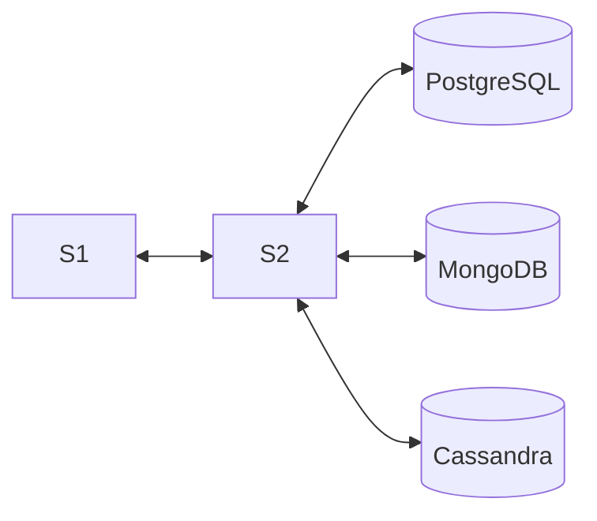

# Polyglot Persistence — Fifa Ultimate Team (FUT)

**Disciplina:** CC6240 — Tópicos Avançados de Banco de Dados
**Tema:** Fifa Ultimate Team (catálogo de jogadores, usuários e transações)

---

## 1) Objetivo do projeto

O projeto tem como objetivo estudar a **persistência poliglota**, escolhendo diferentes tipos de banco de dados conforme o tipo de informação utilizada pela aplicação.

O tema escolhido foi o **Fifa Ultimate Team**, pois os integrantes do grupo jogam Fifa desde o **Fifa 13** e têm grande familiaridade com o jogo, o que facilita o entendimento dos dados e a modelagem do sistema. Além disso, o tema proporciona diferentes tipos de informações, como dados de usuários, estatísticas de jogadores e transações de compra e venda.

Foram desenvolvidos dois serviços principais:

* **S1 (cliente/GUI):** responsável por duas funções principais — exibir os dados vindos dos três bancos de dados (PostgreSQL, MongoDB e Cassandra) e permitir a **inserção de novos dados** em cada um deles, incluindo **usuários**, **transações**, **estatísticas de jogadores** e **jogadores**. Todas as requisições e respostas são registradas em um arquivo de log (`s1_logs.jsonl`).
* **S2 (backend):** sistema que recebe as requisições do S1 e realiza o armazenamento e leitura dos dados nos bancos apropriados.

---

## 2) Arquitetura



* **RDB (PostgreSQL):** armazena os usuários e as transações realizadas.
* **DB1 (MongoDB):** guarda as estatísticas detalhadas de cada jogador.
* **DB2 (Cassandra):** armazena os dados gerais dos jogadores.

---

## 3) Justificativa dos bancos utilizados

* **PostgreSQL:** utilizado para usuários e transações, pois exige estrutura e integridade referencial.
* **MongoDB:** escolhido para armazenar estatísticas de jogadores por permitir dados mais flexíveis e variados.
* **Cassandra:** usado para armazenar informações gerais dos jogadores, garantindo consultas rápidas e fácil expansão.

---

## 4) Entidades principais

| Entidade                   | Campos principais                                                  | Banco de dados |
| -------------------------- | ------------------------------------------------------------------ | -------------- |
| **Usuário**                | id_usuario, nickname, email, senha_hash, pais_origem, data_criacao | PostgreSQL     |
| **Transação**              | id_transacao, id_usuario, jogador_id, tipo, valor, data_transacao  | PostgreSQL     |
| **Estatística do Jogador** | id, nome, ritmo, chute, passe, dribles, defesa, fisico             | MongoDB        |
| **Jogador**                | id, nome, overall, posicao, quantidade, raridade, valor            | Cassandra      |

---

## 5) Estrutura do repositório

```
Banco_de_dados/
├─ s1.py                      # Interface gráfica e cliente (Tkinter)
├─ s2.py                      # Serviço Flask (backend)
├─ postgres.py                # Conexão PostgreSQL
├─ mongodb.py                 # Conexão MongoDB
├─ cassandra_connect.py       # Conexão Cassandra
├─ usuarios.csv               # Dados de usuários
├─ transacoes.csv             # Dados de transações
├─ jogadores.csv              # Dados de jogadores
├─ Informacoes.Estatisticas_jogador.json   # Dados de estatísticas
└─ s1_logs.jsonl              # Logs do cliente
```

---

## 6) Endpoints do S2 (Flask)

Base URL: `http://127.0.0.1:5000`

| Método | Rota          | Descrição                         |
| ------ | ------------- | --------------------------------- |
| GET    | /health       | Teste de conexão                  |
| POST   | /usuarios     | Insere um novo usuário            |
| GET    | /usuarios     | Lista os usuários cadastrados     |
| POST   | /transacoes   | Insere uma nova transação         |
| GET    | /transacoes   | Lista transações realizadas       |
| POST   | /estatisticas | Insere estatísticas de jogador    |
| GET    | /estatisticas | Lista estatísticas cadastradas    |
| POST   | /jogadores    | Insere jogador no banco Cassandra |
| GET    | /jogadores    | Lista jogadores cadastrados       |

---

# 🧩 7) Requisitos para execução

### Softwares necessários

- **Python 3.11+**
- **PostgreSQL** (local)
- **MongoDB** (local)
- **Cassandra** (pode ser via Docker)

### Bibliotecas Python

No diretório do projeto, execute:

```bash
pip install flask flask-cors requests psycopg2-binary pymongo cassandra-driver
```
---

## 8) Criação e carga inicial dos bancos de dados
Você tem duas opções: <br>
* 1 - Usar a interface S1 para ir cadastrando os dados manualmente (usuário, transação, jogador, estatísticas); <br>
* 2 - Carregar os arquivos de exemplo do repositório (.csv e .json) para já popular os bancos.

## 8.1 PostgreSQL
* 1 - Acesse o psql:
```bash
psql -U seu_usuario
```

* 2 - Crie o banco e o schema:
```
CREATE DATABASE "Fifa_Ultimate";
\c "Fifa_Ultimate";

CREATE SCHEMA fut;

CREATE TABLE fut.usuarios (
  id_usuario INT PRIMARY KEY,
  nickname TEXT,
  email TEXT,
  senha_hash TEXT,
  pais_origem TEXT,
  data_criacao TIMESTAMP
);

CREATE TABLE fut.transacoes (
  id_transacao INT PRIMARY KEY,
  id_usuario INT REFERENCES fut.usuarios(id_usuario),
  jogador_id INT,
  tipo TEXT,
  valor NUMERIC,
  data_transacao DATE
);
```
* 3 - Importe os arquivos CSV do repositório (usuarios.csv e transacoes.csv). <br>
Dentro do psql, no banco Fifa_Ultimate:
```
\copy fut.usuarios FROM 'caminho/para/usuarios.csv' DELIMITER ',' CSV HEADER;
\copy fut.transacoes FROM 'caminho/para/transacoes.csv' DELIMITER ',' CSV HEADER;
```
## 8.2 MongoDB 

Banco: ```Informacoes```<br>
Coleção: ```Estatisticas_jogador``` <br>
No diretório onde está o arquivo ```Informacoes.Estatisticas_jogador.json```, execute: 
```
mongoimport --uri "mongodb://localhost:27017/Informacoes" \
  --collection Estatisticas_jogador \
  --file Informacoes.Estatisticas_jogador.json \
  --jsonArray
```
## 8.3 Cassandra (via Docker)

* 1 - Suba um container com Cassandra:
  
```
docker run -d --name cassandra \
  -p 9042:9042 cassandra:4.1
```
* 2 - Acesse o cqlsh dentro do container:
```
docker exec -it cassandra cqlsh
```
* 3 - Crie o keyspace e a tabela:
```
CREATE KEYSPACE futdb WITH replication = {
  'class': 'SimpleStrategy',
  'replication_factor': 1
};

USE futdb;

CREATE TABLE jogadores (
  id int PRIMARY KEY,
  nome text,
  overall int,
  posicao text,
  quantidade int,
  raridade text,
  valor decimal
);
```
* 4 - Para importar o arquivo jogadores.csv <br>
```
docker cp jogadores.csv cassandra:/jogadores.csv
```
---

## ▶️ 9) Execução do sistema

O projeto é dividido em dois serviços:

* S2 – servidor Flask que faz a conexão com os três bancos (PostgreSQL, MongoDB e Cassandra).

* S1 – interface Flask que consome o S2, permite inserir e listar dados, e gera logs.

Passo a passo

* 1 - Com os bancos rodando (PostgreSQL, MongoDB e Cassandra), vá até a pasta do projeto.

* 2 - Em um terminal, inicie o servidor S2:

```
python s2.py
```
* 3 - Em outro terminal, inicie a interface S1:
```
python s1.py
```
---

## ✅ 10) Testes e resultados

Na interface S1, você poderá:

* Inserir dados:

```fut.usuarios``` e ```fut.transacoes``` (PostgreSQL)

```jogadores```(Cassandra)

```Estatisticas_jogador``` (MongoDB).

* Listar dados

Exibe os registros salvos em cada banco em uma interface 

* Ver logs

Todas as requisições e respostas entre S1 e S2 são registradas no arquivo:

```s1_logs.jsonl ```
## 11) Autores

* **Guilherme Matias** — RA: 22.122.071-8
* **Caio Arnoni** — RA: 22.221.019-7
* **Gustavo Lemos** — RA: 22.123.064-2
