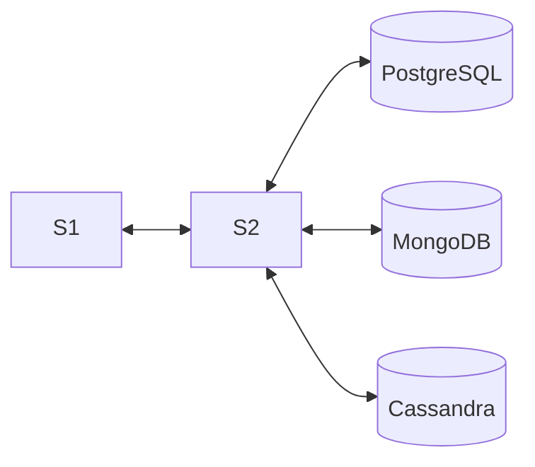

# Polyglot Persistence — Fifa Ultimate Team (FUT)

**Disciplina:** CC6240 — Tópicos Avançados de Banco de Dados
**Tema:** Fifa Ultimate Team (catálogo de jogadores, usuários e transações)

---

## 1) Objetivo do projeto

O projeto tem como objetivo estudar a **persistência poliglota**, escolhendo diferentes tipos de banco de dados conforme o tipo de informação utilizada pela aplicação.

O tema escolhido foi o **Fifa Ultimate Team**, pois os integrantes do grupo jogam Fifa desde o **Fifa 13** e têm grande familiaridade com o jogo, o que facilita o entendimento dos dados e a modelagem do sistema. Além disso, o tema proporciona diferentes tipos de informações, como dados de usuários, estatísticas de jogadores e transações de compra e venda.

Foram desenvolvidos dois serviços principais:

* **S1 (cliente/GUI):** responsável por duas funções principais — exibir os dados vindos dos três bancos de dados (PostgreSQL, MongoDB e Cassandra) e permitir a **inserção de novos dados** em cada um deles, incluindo **usuários**, **transações**, **estatísticas de jogadores** e **jogadores**. Todas as requisições e respostas são registradas em um arquivo de log (`s1_logs.jsonl`).
* **S2 (backend):** sistema que recebe as requisições do S1 e realiza o armazenamento e leitura dos dados nos bancos apropriados.

---

## 2) Arquitetura



* **RDB (PostgreSQL):** armazena os usuários e as transações realizadas.
* **DB1 (MongoDB):** guarda as estatísticas detalhadas de cada jogador.
* **DB2 (Cassandra):** armazena os dados gerais dos jogadores.

---

## 3) Justificativa dos bancos utilizados

* **PostgreSQL:** utilizado para usuários e transações, pois exige estrutura e integridade referencial.
* **MongoDB:** escolhido para armazenar estatísticas de jogadores por permitir dados mais flexíveis e variados.
* **Cassandra:** usado para armazenar informações gerais dos jogadores, garantindo consultas rápidas e fácil expansão.

---

## 4) Entidades principais

| Entidade                   | Campos principais                                                  | Banco de dados |
| -------------------------- | ------------------------------------------------------------------ | -------------- |
| **Usuário**                | id_usuario, nickname, email, senha_hash, pais_origem, data_criacao | PostgreSQL     |
| **Transação**              | id_transacao, id_usuario, jogador_id, tipo, valor, data_transacao  | PostgreSQL     |
| **Estatística do Jogador** | id, nome, ritmo, chute, passe, dribles, defesa, fisico             | MongoDB        |
| **Jogador**                | id, nome, overall, posicao, quantidade, raridade, valor            | Cassandra      |

---

## 5) Estrutura do repositório

```
Banco_de_dados/
├─ s1.py                      # Interface gráfica e cliente (Tkinter)
├─ s2.py                      # Serviço Flask (backend)
├─ postgres.py                # Conexão PostgreSQL
├─ mongodb.py                 # Conexão MongoDB
├─ cassandra_connect.py       # Conexão Cassandra
├─ usuarios.csv               # Dados de usuários
├─ transacoes.csv             # Dados de transações
├─ jogadores.csv              # Dados de jogadores
├─ Informacoes.Estatisticas_jogador.json   # Dados de estatísticas
└─ s1_logs.jsonl              # Logs do cliente
```

---

## 6) Endpoints do S2 (Flask)

Base URL: `http://127.0.0.1:5000`

| Método | Rota          | Descrição                         |
| ------ | ------------- | --------------------------------- |
| GET    | /health       | Teste de conexão                  |
| POST   | /usuarios     | Insere um novo usuário            |
| GET    | /usuarios     | Lista os usuários cadastrados     |
| POST   | /transacoes   | Insere uma nova transação         |
| GET    | /transacoes   | Lista transações realizadas       |
| POST   | /estatisticas | Insere estatísticas de jogador    |
| GET    | /estatisticas | Lista estatísticas cadastradas    |
| POST   | /jogadores    | Insere jogador no banco Cassandra |
| GET    | /jogadores    | Lista jogadores cadastrados       |

---

## 7) Requisitos para execução

**Softwares:**

* Python 3.11+
* PostgreSQL
* MongoDB
* Cassandra (pode ser via Docker)

**Instalação das bibliotecas:**

```bash
pip install flask flask-cors requests psycopg2-binary pymongo cassandra-driver
```

---

## 8) Criação dos bancos

### PostgreSQL

```sql
CREATE DATABASE "Fifa_Ultimate";
CREATE SCHEMA fut;

CREATE TABLE fut.usuarios (
  id_usuario INT PRIMARY KEY,
  nickname TEXT,
  email TEXT,
  senha_hash TEXT,
  pais_origem TEXT,
  data_criacao TIMESTAMP
);

CREATE TABLE fut.transacoes (
  id_transacao INT PRIMARY KEY,
  id_usuario INT REFERENCES fut.usuarios(id_usuario),
  jogador_id INT,
  tipo TEXT,
  valor NUMERIC,
  data_transacao DATE
);
```

### MongoDB

Banco: `Informacoes`
Coleção: `Estatisticas_jogador`

```bash
mongoimport --uri "mongodb://localhost:27017/Informacoes" \
  --collection Estatisticas_jogador \
  --file Informacoes.Estatisticas_jogador.json --jsonArray
```

### Cassandra

```sql
CREATE KEYSPACE futdb WITH replication = {'class': 'SimpleStrategy', 'replication_factor': 1};
USE futdb;

CREATE TABLE jogadores (
  id int PRIMARY KEY,
  nome text,
  overall int,
  posicao text,
  quantidade int,
  raridade text,
  valor decimal
);
```

---

## 9) Execução do sistema

1. Inicie o servidor Flask (S2):

```bash
python s2.py
```

2. Em outro terminal, execute a interface (S1):

```bash
python s1.py
```

A interface permite inserir e listar dados de cada banco, e gera logs automáticos.

---

## 10) Testes e resultados

* **Listar:** exibe os registros salvos em cada banco de dados.
* **Inserir:** cria novos dados reais de exemplo (usuário, transação, jogador, estatística).
* **Logs:** todas as requisições e respostas ficam registradas em `s1_logs.jsonl`.

---

## 11) Autores

* **Guilherme Matias** — RA: 22.122.071-8
* **Caio Arnoni** — RA: 22.221.019-7
* **Gustavo Lemos** — RA: 22.123.064-2
