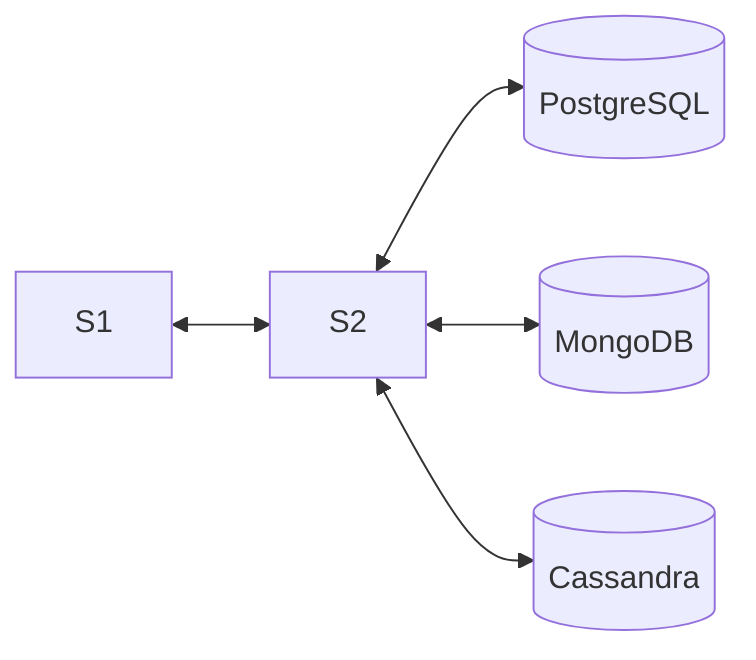

# Polyglot Persistence — Fifa Ultimate Team (FUT)

**Disciplina:** CC6240 — Tópicos Avançados de Banco de Dados  
**Tema:** Fifa Ultimate Team (catálogo de jogadores, usuários e transações)  
**Arquitetura:** S1 ↔ S2 com **PostgreSQL** (RDB), **MongoDB** (Document Store) e **Cassandra** (Wide‑Column)

---

## 1) Objetivo do projeto
Estudar **persistência poliglota**, escolhendo o tipo de banco de dados com base no **uso do dado pela aplicação**. O projeto implementa dois serviços:

- **S1 (cliente/GUI):** aplicativo Tkinter que dispara requisições a S2 (inserção e leitura) e **registra logs** de todas as chamadas em `s1_logs.jsonl` (requisitações + respostas), atendendo ao requisito de auditoria do funcionamento do S1.  
- **S2 (backend/Flask):** expõe endpoints REST e orquestra o armazenamento/consulta nos bancos adequados.

O **tema** (FUT) foi escolhido por combinar dados **relacionais** (usuários/relacionamentos), **semi‑estruturados** (estatísticas diversas por jogador) e **colunar/escala** (catálogo de jogadores/consultas de leitura).

---

## 2) Arquitetura (exigida)


- **RDB (PostgreSQL):** `fut.usuarios` e `fut.transacoes` (integridade, joins, ordenação).  
- **DB1 (MongoDB):** `Informações.Estatisticas_jogador` (flexível por jogador).  
- **DB2 (Cassandra):** `futdb.jogadores` (catálogo simples, leitura rápida e horizontalmente escalável).

---

## 3) Justificativa das escolhas
- **PostgreSQL (Relacional):** Ideal para **usuários** e **transações** por exigir **consistência**, **chaves estrangeiras** e **consultas relacionais** (joins por `id_usuario`, ordenação por data).  
- **MongoDB (Document Store):** Estatísticas de jogadores variam (campos, versões, granularidades). O **modelo flexível** de documentos evita migrações frequentes e suporta evolução do schema.  
- **Cassandra (Wide‑Column):** Tabela de **jogadores** com leituras massivas, pouco relacionamento e chave de partição simples. Permite **escrita/leitura** distribuída e **baixa latência** em escala. No projeto usamos **query‑pattern simples por id** e listagem ordenada em memória (Cassandra não faz `ORDER BY` arbitrário).

---

## 4) Entidades e mapeamento de persistência
| Entidade | Campos principais (exemplos) | Banco/Modelo |
|---|---|---|
| **Usuário** | `id_usuario`, `nickname`, `email`, `senha_hash`, `pais_origem`, `data_criacao` | **PostgreSQL** (`fut.usuarios`) |
| **Transação** | `id_transacao`, `id_usuario`, `jogador_id`, `tipo`(compra/venda), `valor`, `data_transacao` | **PostgreSQL** (`fut.transacoes`) |
| **Estatística do Jogador** | `id`, `Nome`, `Overall`, `Ritmo`, `Chute`, `Passe`, `Dribles`, `Defesa`, `Físico`, ... | **MongoDB** (`Informações.Estatisticas_jogador`) |
| **Jogador (catálogo)** | `id`, `nome`, `overall`, `posicao`, `quantidade`, `raridade`, `valor` | **Cassandra** (`futdb.jogadores`) |

Bases de dados/datasets no repositório:  
- `usuarios.csv`, `transacoes.csv`, `jogadores.csv` e `Informações.Estatisticas_jogador.json` (amostras para carga/validação).

---

## 5) Estrutura do repositório
```
Banco_de_dados/
├─ s1.py                      # Serviço S1 (GUI Tkinter)
├─ s2.py                      # Serviço S2 (Flask + REST)
├─ postgres.py                # Conexão PostgreSQL
├─ mongodb.py                 # Conexão MongoDB
├─ cassandra_connect.py       # Conexão Cassandra
├─ usuarios.csv               # Amostra de usuários (RDB)
├─ transacoes.csv             # Amostra de transações (RDB)
├─ jogadores.csv              # Amostra de jogadores (Cassandra)
├─ Informações.Estatisticas_jogador.json   # Amostra de docs (Mongo)
└─ s1_logs.jsonl              # Logs de S1 (gerado em tempo de execução)
```

---

## 6) Endpoints do S2 (Flask)
Base URL padrão: `http://127.0.0.1:5000`

- `GET  /health` → status/heartbeat.  
- `POST /usuarios` → insere usuário no Postgres (`fut.usuarios`).  
- `GET  /usuarios?nickname=...` **ou** `?id_usuario=...` → lista usuários/filtra.  
- `POST /transacoes` → insere transação no Postgres (`fut.transacoes`).  
- `GET  /transacoes?nickname=...` **ou** `?id_usuario=...` → lista/filtra.  
- `POST /estatisticas` → insere documento no Mongo (`Estatisticas_jogador`).  
- `GET  /estatisticas` → lista documentos (oculta `_id`, ordena por `id` se existir).  
- `POST /jogadores` → insere registro em Cassandra (`futdb.jogadores`).  
- `GET  /jogadores` → lista jogadores (ordenado em memória por `id`).

> O S1 já envia **payloads de exemplo** para todos os `POST` (vide botões “＋” na GUI).

---

## 7) Pré‑requisitos
- **Python 3.11+** (bibliotecas: `flask`, `flask-cors`, `requests`, `psycopg2-binary`, `pymongo`, `cassandra-driver`, `tkinter`).  
- **PostgreSQL 14+** (local).  
- **MongoDB 6+** (local).  
- **Cassandra 4.x** (local ou via Docker).

Instalação das dependências Python:
```bash
pip install flask flask-cors requests psycopg2-binary pymongo cassandra-driver
```

---

## 8) Preparação dos bancos

### 8.1 PostgreSQL (RDB)
1. Crie o banco e o schema (ajuste credenciais em `postgres.py` — **não comite senhas reais**):
```sql
CREATE DATABASE "Fifa_Ultimate";
\c Fifa_Ultimate;

CREATE SCHEMA fut;

CREATE TABLE fut.usuarios (
  id_usuario   INT PRIMARY KEY,
  nickname     TEXT NOT NULL UNIQUE,
  email        TEXT NOT NULL UNIQUE,
  senha_hash   TEXT NOT NULL,
  pais_origem  TEXT,
  data_criacao TIMESTAMP NOT NULL DEFAULT now()
);

CREATE TABLE fut.transacoes (
  id_transacao   INT PRIMARY KEY,
  id_usuario     INT NOT NULL REFERENCES fut.usuarios(id_usuario),
  jogador_id     INT NOT NULL,
  tipo           TEXT CHECK (tipo IN ('COMPRA','VENDA')),
  valor          NUMERIC(12,2) NOT NULL,
  data_transacao DATE NOT NULL DEFAULT CURRENT_DATE
);
```

2. Se quiser, carregue amostras (psql `\copy` a partir dos CSVs do repositório).

> O arquivo `postgres.py` define o **dbname** `Fifa_Ultimate` e utiliza o **schema** `fut` nos SQLs. Ajuste `host`, `user`, `password` conforme seu ambiente.

---

### 8.2 MongoDB (Document Store)
- Banco: **`Informações`** (atenção ao acento).  
- Coleção: **`Estatisticas_jogador`**.

Importe o JSON de amostra (ou envie via endpoint `POST /estatisticas`):
```bash
# via mongoimport (adaptar caminho):
mongoimport --uri "mongodb://localhost:27017/Informações"   --collection Estatisticas_jogador   --file "Informações.Estatisticas_jogador.json"   --jsonArray
```

---

### 8.3 Cassandra (Wide‑Column)
Suba Cassandra rapidamente com Docker:
```bash
docker run -d --name cassandra -p 9042:9042 cassandra:4.1
# aguarde ~30-60s até ficar pronto
docker exec -it cassandra cqlsh
```
Crie o **keyspace** e a **tabela** esperados por `s2.py`:
```sql
CREATE KEYSPACE IF NOT EXISTS futdb
WITH replication = {'class': 'SimpleStrategy', 'replication_factor': 1};

USE futdb;

CREATE TABLE IF NOT EXISTS jogadores (
  id          int PRIMARY KEY,
  nome        text,
  overall     int,
  posicao     text,
  quantidade  int,
  raridade    text,
  valor       decimal
);
```
> A listagem em `GET /jogadores` faz `ORDER BY` **em memória** (boa prática em Cassandra é modelar conforme o *query pattern*).

---

## 9) Execução

### Passo 1 — iniciar S2 (backend)
```bash
python s2.py
# sobe em http://127.0.0.1:5000
```

### Passo 2 — iniciar S1 (cliente/GUI)
```bash
python s1.py
# abre interface Tkinter com botões para listar/inserir em cada banco
```
O S1 gravará **todas as requisições** e **respostas** em `s1_logs.jsonl` (um JSON por linha).

---

## 10) Evidências e validação
- Guia “Listar” na GUI → `GET /usuarios`, `GET /transacoes`, `GET /estatisticas`, `GET /jogadores`.  
- Guia “Inserir” na GUI → exemplos reais de `POST` para cada banco (payloads prontos).  
- `GET /health` para *heartbeat*.  
- Logs em `s1_logs.jsonl` para auditoria (requisito de “S1 armazena requisições e respostas”).

---

## 11) Como S2 foi implementado
- **Flask + CORS** para os endpoints REST.  
- **PostgreSQL:** `psycopg2` com SQL explícito (DML/SELECT).  
- **MongoDB:** `pymongo` (coleção `Estatisticas_jogador`).  
- **Cassandra:** `cassandra-driver` com `SimpleStatement`, `keyspace=futdb`.

Tratamento básico de indisponibilidade (ex.: `ServerSelectionTimeoutError` no Mongo).

---

## 12) Autores
- **Guilherme Matias** — RA: 22.122.071-8  
- **Caio Arnoni** — RA: 22.221.019-7  
- **Gustavo Lemos** — RA: 22.123.064-2

---

## 13) Observações finais e boas práticas
- **Credenciais:** evite senhas em código/versionamento. Sugestão: `.env` + `os.getenv()` (adapte `postgres.py`, `mongodb.py`).  
- **Carga inicial:** os CSV/JSON podem ser importados para testes rápidos (psql, mongoimport, cqlsh).  
- **Evolução:** para Cassandra, modele *partition keys* conforme *query pattern* alvo se surgirem filtros por `posicao`, `raridade`, etc.
